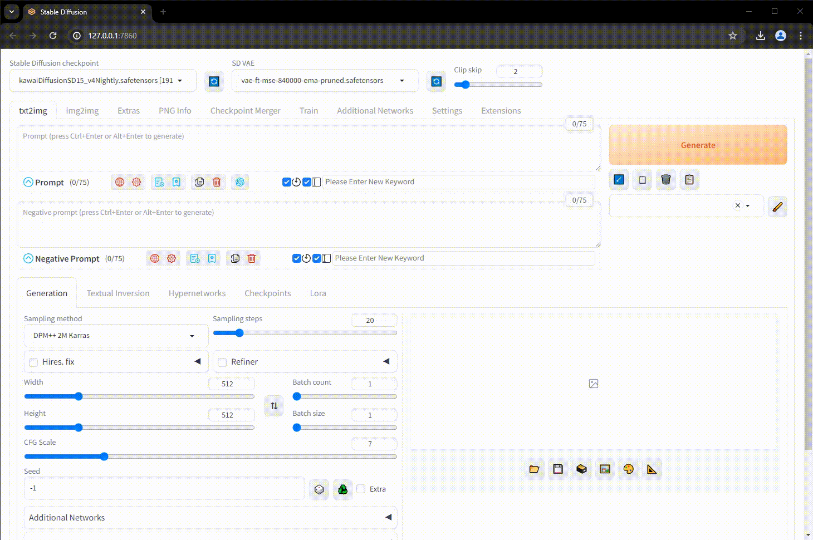

### [ [English README.md](README_en.md) ]

# sd-webui-prompt-organizer

此扩展插件协助 [Stable Diffusion Web UI](https://github.com/AUTOMATIC1111/stable-diffusion-webui) 用户将生成图片保存到 www.txt2any.com.

# TL;DR txt2any 是什么
当AI生成的图片上传至 txt2any，服务器会处理并提取被 AUTO1111 或 ComfyUI 注入的元数据。利用它能使用户在不同的创作迭代之间将提示词进行逐字比较，将生成参数也进行逐个比对。这样能帮助用户更好的理解提示词增、删、改、排序、权重以及参数调整对输出质量的影响。用户也可以与其他创造者的作品进行比较学习。与此同时，用户还能获得一个云存储来暂存创作。免费的订阅计划将会一直免费。

## 如何安装

1. 打开 "Extensions" 标签页.
2. 转至 "Install from URL" 子标签页.
3. 输入 `https://github.com/txt2any/sd-webui-prompt-organizer` 至输入框 "URL for extension's git repository".
4. 点击 "Install" 按钮.
5. 等待大约五秒钟, 界面会显示 "Installed into stable-diffusion-webui\extensions\sd-webui-prompt-organizer. Use Installed tab to restart".
6. 转至 "Installed" 子标签, 点击 "Check for updates", 再点击 "Apply and restart UI". (之后将重复此步骤用以更新扩展插件.)
7. 彻底重启 A1111 用户界面以及后台的命令行进程.

## 如何使用 txt2any

### 设置

从 txt2any 的用户账户中生成 API 密钥并将此密钥保存至 A1111 用户界面。

### 如何使用 txt2any 的“提示词收纳盒”功能

点击进入 txt2img 标签页并生成一张图片。在输出区域会出现一个 txt2any 的图标。点击此图标将会弹出该图片的预览和详细生成信息。点击空白处可以关闭预览并与其他图片进行提示词和生成参数的比较。

## 贡献代码

欢迎大家提交 PR 来丰富本扩展插件。本插件不局限于 txt2any 的服务。欢迎重复利用该代码去支持各种各样的存储和额外的服务。

加入我们的 [Discord 服务器](https://discord.gg/uWm4df9nQX) 进行交流. 