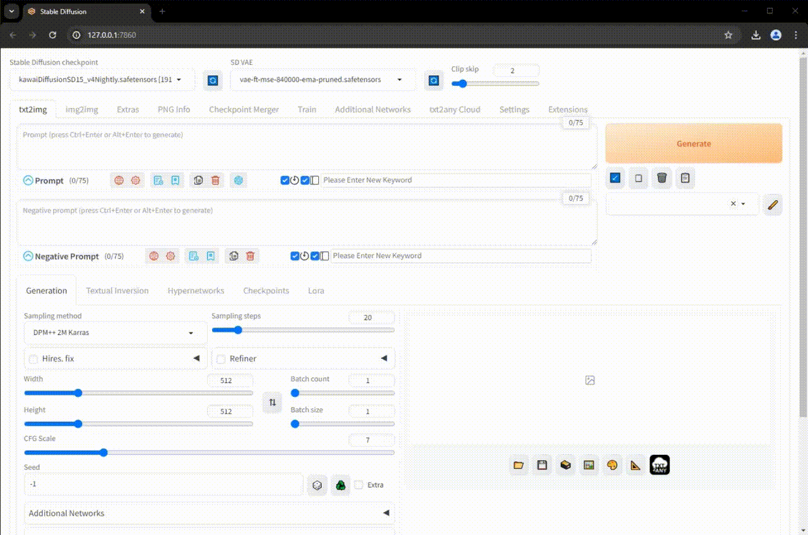
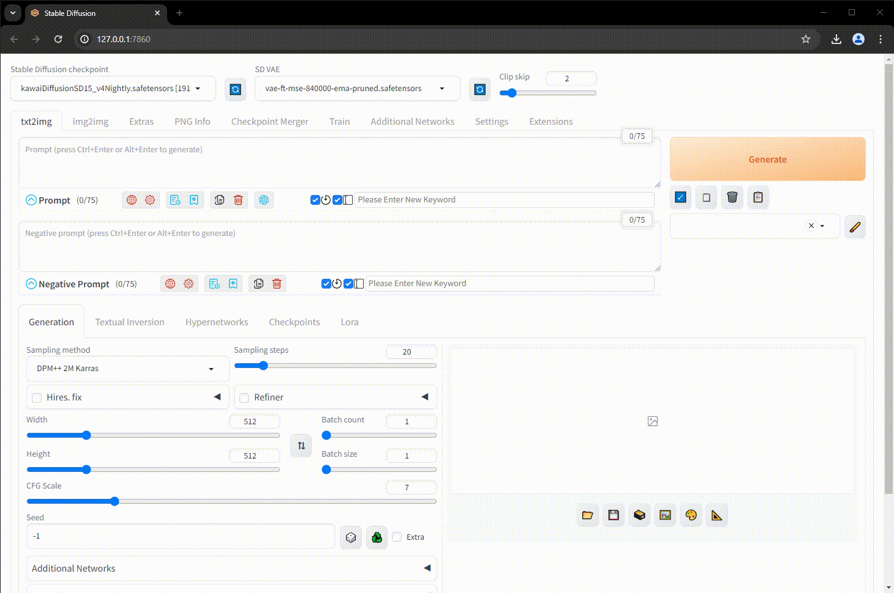
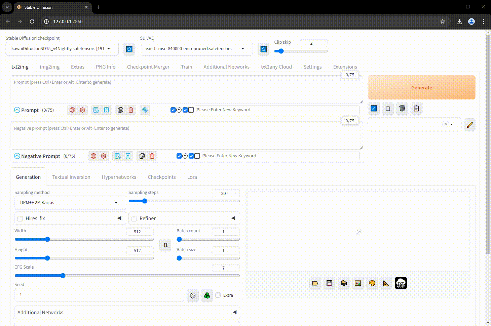

# sd-webui-prompt-organizer
This is an extension for [Stable Diffusion Web UI](https://github.com/AUTOMATIC1111/stable-diffusion-webui) that automatically saves your AI-generated images specifically to www.txt2any.com.

# TL;DR What is txt2any
When you upload AI-generated images to txt2any, the server processes and extracts the metadata injected by AUTO1111 or ComfyUI. It allows you to compare prompt text word by word and generation data parameter by parameter so that you can understand the significance of each text or parameter in order to achieve a better result. Additionally, you will have access to cloud storage. The free tier will always remain free.

## Installation

1. Open "Extensions" tab.
2. Open "Install from URL" tab in the tab.
3. Enter `https://github.com/txt2any/sd-webui-prompt-organizer` to "URL for extension's git repository".
4. Press "Install" button.
5. Wait for 5 seconds, and you will see the message "Installed into stable-diffusion-webui\extensions\sd-webui-prompt-organizer. Use Installed tab to restart".
6. Go to "Installed" tab, click "Check for updates", and then click "Apply and restart UI". (The next time you can also use these buttons to update the extension.)
7. Completely restart A1111 webui including the backend through your terminal.

## Getting started

### Configuration

Generate an API Key from your txt2any account and save it in A1111 webui.

### How to use the txt2any Prompt Organizer

Go to the `txt2img` tab and follow your usual practice to generate an image. You will see a `txt2any` icon in the output area. Simply click on that icon and it will take you to the image in the cloud and display all the generation data. More features are available such as Prompt Comparison and Generation Data Comparison.

## Contribution

We welcome more features related to storage for this extension such as saving to a Google Drive or other cloud storage services. If you have any good ideas please don't hesitate to let us know and raise a pull request.

Please join our [Discord Server](https://discord.gg/uWm4df9nQX) for more information. 